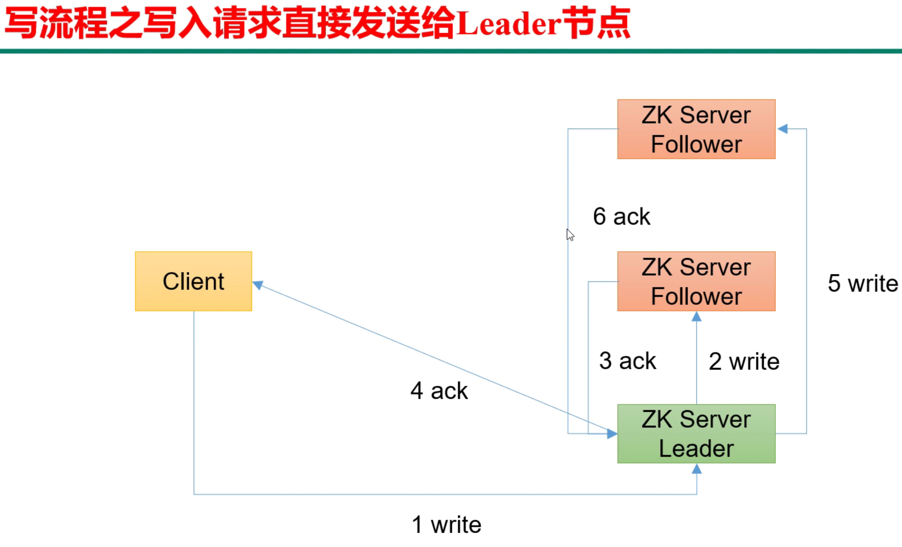
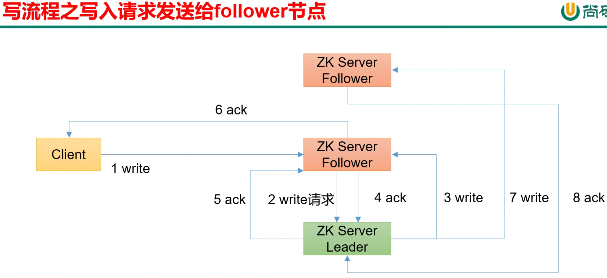
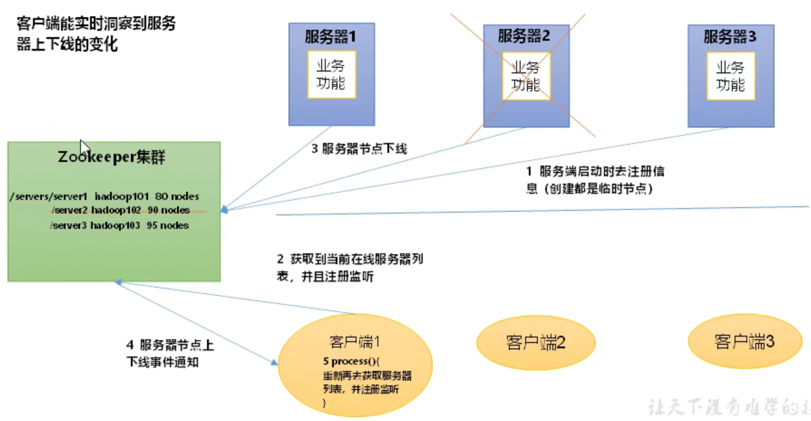
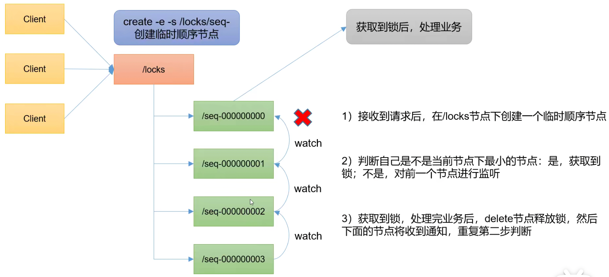
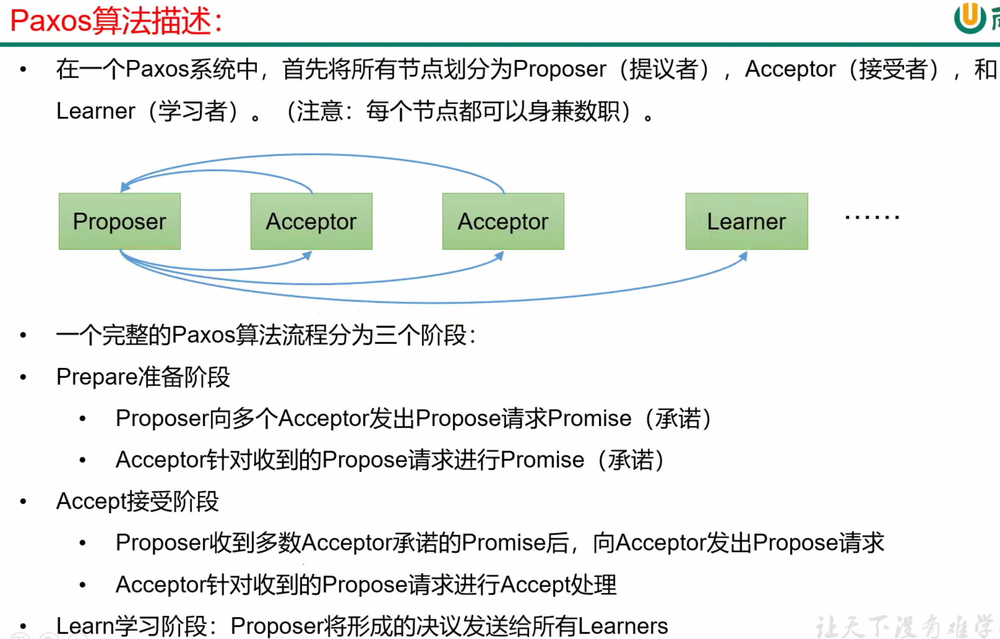
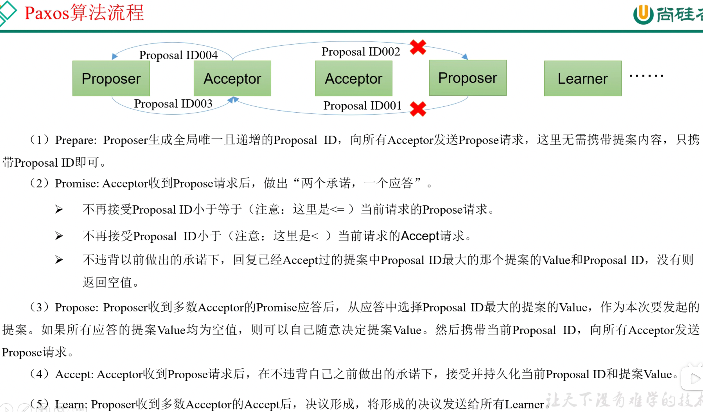
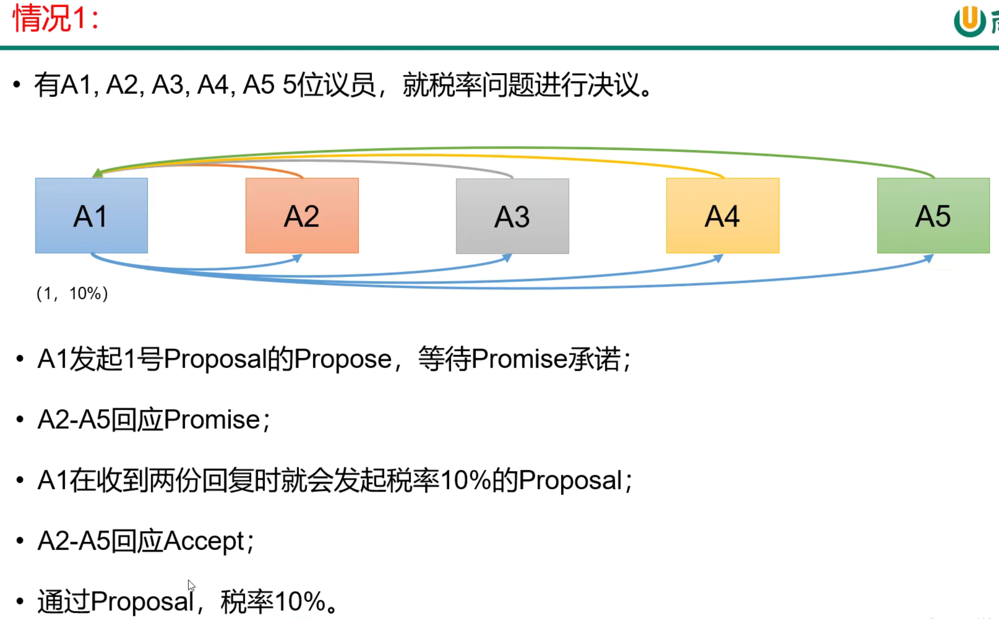
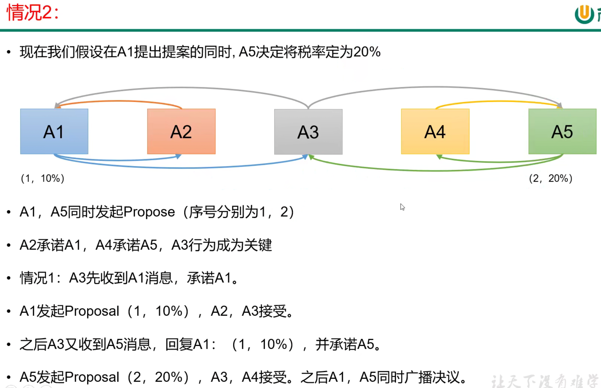
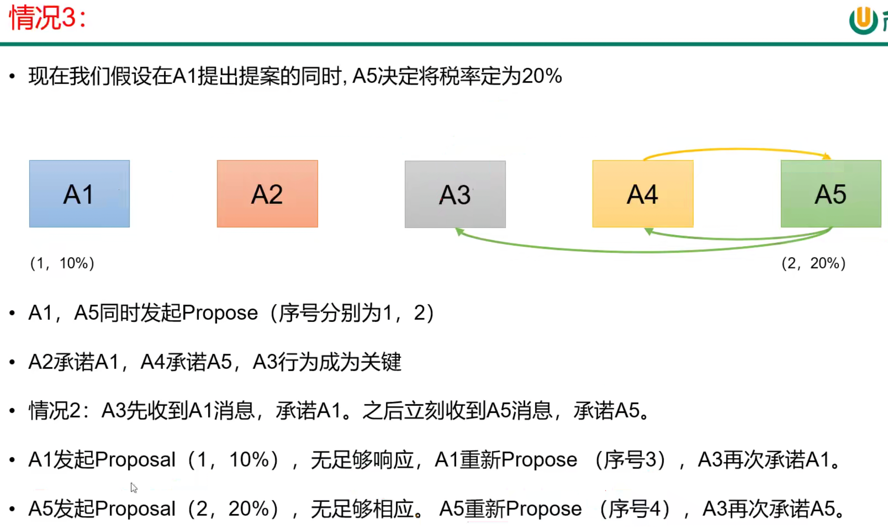

# 客户端

- 启动客户端并连接到IP为172.17.0.12的服务器：./zkCli.sh -server 172.17.0.12:2181

# 节点

注意和server的概念区分

## 节点类型

- 持久（Persistent）：客户端和服务器端断开连接后，创建的节点不删除

    - 持久化目录节点：客户端与zookeeper断开连接后，该节点依旧存在，/znode1，Persistent
    
    - 持久化顺序编号目录节点：客户端与zookeeper断开连接后，该节点依旧存在，只是zk给该节点名称进行顺序编号，/znode2_001，Persistent_sequential
    顺序号是单调递增的计数器，由父节点维护。在分布式系统中，顺序号可以被用于为所有的时事件进行全局排序，客户端可以通过顺序号推断事件的顺序

- 短暂（Ephemeral）：客户端和服务器端断开连接后，创建的节点自己删除

    - 临时目录节点：客户端与zookeeper断开连接后，该节点被删除，/znode3，Ephemeral
    
    - 临时顺序编号目录节点：客户端与zookeeper断开连接后，该节点被删除，只是zk给该节点名称进行顺序编号，/znode4_001，Ephemeral_sequential

- 有序号

- 无序号

## 命令行操作

客户端连接到服务器端后通过命令行创建节点

- 创建持久化目录节点：create /sanguo "hanxiandi"

- 查看持久化目录节点：get -s /sanguo

- 查看持久化目录节点的子节点：ls /sanguo

- 创建持久化顺序编号目录节点：create -s /sanguo/weiguo/zhangliao "zhangliao"，连续执行该语句，节点后序号自增

- 创建临时目录节点：create -e /sanguo/wuguo "zhouyu"

- 创建临时顺序编号目录节点：create -e -s /sanguo/wuguo "zhouyu"

- 修改节点数据值：set /sanguo/weiguo "simayi"

# 监听器原理


- 监听节点值：get -w /sanguo 若通过set修改节点值，会返回WATCHER::WatchedEvent state:SyncConnected type:NodeDataChanged path:/sanguo
  注意，这样设置只注册一次，下次改变节点值不会监听
  
- 监听节点路径变化：ls -w /sanguo 若通过create /sanguo/jin "simayi"，会返回监听结果

- 删除节点：delete /sanguo/jin

- 递归删除节点：deleteall /sanguo

- 查看节点状态：stat /sanguo

# 客户端向服务端写数据的流程

## 写入请求直接发送给Leader



## 写入请求直接发送给Follower



# 案例-服务器动态上下线

```bash
# 预备知识
# maven编译
mvn compile
# 运行项目
mvn exec:java -Dexec.mainClass="com.zhutao.case1.DistributeServer" -Dexec.args="hadoop102"
```



1、服务端上线时去zk注册信息

2、客户端向zk获取到当前在线服务器列表，并且注册监听

3、服务器下线

4、客户端得到服务器下线通知

# 案例-分布式锁



# 拜占庭将军问题

拜占庭将军问题（Byzantine failures），是由莱斯利·兰伯特提出的点对点通信中的基本问题。含义是在存在消息丢失的不可靠信道上试
图通过消息传递的方式达到一致性是不可能的。

拜占庭将军问题是一个协议问题，拜占庭帝国军队的将军们必须全体一致的决定是否攻击某一支敌军。问题是这些将军在地理上是分隔开来的，
并且将军中存在叛徒。叛徒可以任意行动以达到以下目标：欺骗某些将军采取进攻行动；促成一个不是所有将军都同意的决定，如当将军们不
希望进攻时促成进攻行动；或者迷惑某些将军，使他们无法做出决定。如果叛徒达到了这些目的之一，则任何攻击行动的结果都是注定要失败
的，只有完全达成一致的努力才能获得胜利。

## paxos算法

概念：是一种基于消息传递且具有高度容错特性的一致性算法

解决的问题：就是如何快速正确的在一个分布式系统中对某个数据值达成一致，并且保证不论发生任何异常，都不会破坏整个系统的一致性。











A1和A5不断发起Propose，出现活锁问题。造成这种情况的原因是系统中有一个以上的proposer，多个proposers互相争夺acceptor，
造成迟迟无法达成一致的情况。针对这种情况，一种改进的paxos算法被提出：从系统中选出一个节点作为Leader，只有Leaderne能够
发起提案，这样，一次Paxos流程中只有一个proposer，不会出现活锁问题，此时只会出现case1。

## ZAB算法