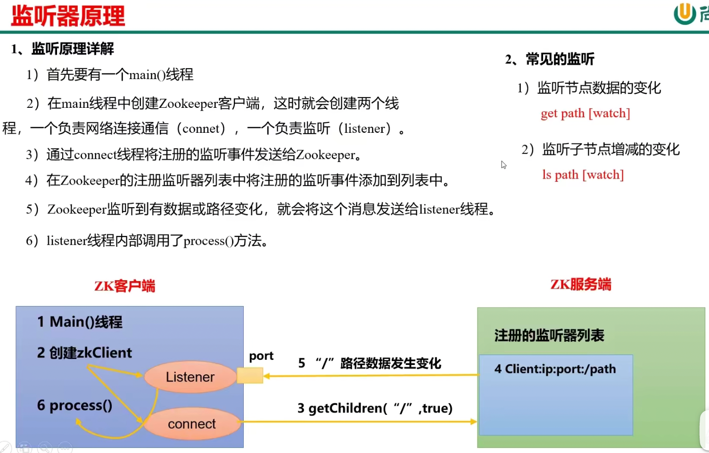

# 客户端

- 启动客户端：./zkCli.sh -server 172.17.0.12:2181

# 节点

注意和server的概念区分

## 节点类型

- 持久（Persistent）：客户端和服务器端断开连接后，创建的节点不删除

    - 持久化目录节点：客户端与zookeeper断开连接后，该节点依旧存在，/znode1，Persistent
    
    - 持久化顺序编号目录节点：客户端与zookeeper断开连接后，该节点依旧存在，只是zk给该节点名称进行顺序编号，/znode2_001，Persistent_sequential
    顺序号是单调递增的计数器，由父节点维护。在分布式系统中，顺序号可以被用于为所有的时事件进行全局排序，客户端可以通过顺序号推断事件的顺序

- 短暂（Ephemeral）：客户端和服务器端断开连接后，创建的节点自己删除

    - 临时目录节点：客户端与zookeeper断开连接后，该节点被删除，/znode3，Ephemeral
    
    - 临时顺序编号目录节点：客户端与zookeeper断开连接后，该节点被删除，只是zk给该节点名称进行顺序编号，/znode4_001，Ephemeral_sequential

- 有序号

- 无序号

## 命令行操作

- 创建持久化目录节点：create /sanguo "hanxiandi"

- 查看持久化目录节点：get -s /sanguo

- 查看持久化目录节点的子节点：ls /sanguo

- 创建持久化顺序编号目录节点：create -s /sanguo/weiguo/zhangliao "zhangliao"，连续执行该语句，节点后序号自增

- 创建临时目录节点：create -e /sanguo/wuguo "zhouyu"

- 创建临时顺序编号目录节点：create -e -s /sanguo/wuguo "zhouyu"

- 修改节点数据值：set /sanguo/weiguo "simayi"

# 监听器原理

- 监听节点值：get -w /sanguo 若通过set修改节点值，会返回WATCHER::WatchedEvent state:SyncConnected type:NodeDataChanged path:/sanguo
  注意，这样设置只注册一次，下次改变节点值不会监听
  
- 监听节点路径变化：ls -w /sanguo 若通过create /sanguo/jin "simayi"，会返回监听结果

- 删除节点：delete /sanguo/jin

- 递归删除节点：deleteall /sanguo

- 查看节点状态：stat /sanguo